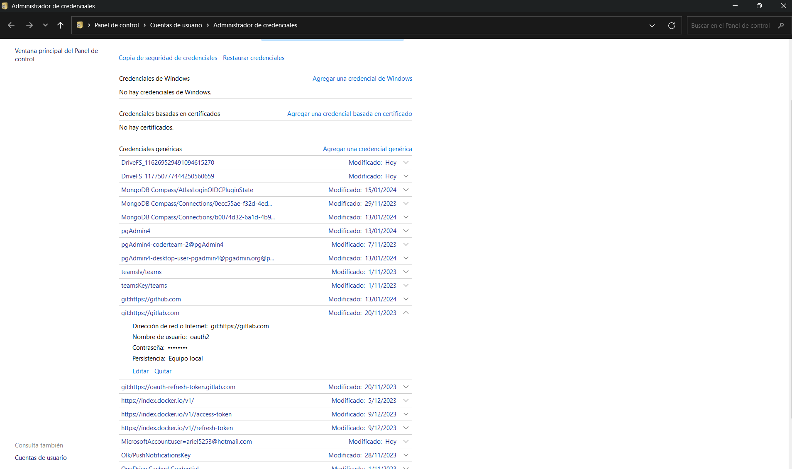

# analisis-sistemas-2024-a
2024-1 Análisis de Sistemas

# Pasos para trabajar con git

## Paso 1: 
Instalar git: https://git-scm.com/

## Configurar cuenta
```git
git config --global user.name "John Doe"
git config --global user.email johndoe@example.com
```
Nota: Si hay una cuenta autenticada, esta se debe eliminar primero. 

1. Acceder a credenciales del S.O
2. Eliminar cuenta
3. Ver imagen



## Clonar repositorio
```git
    git clone https://github.com/code-corhuila/analisis-sistemas-2024-a.git
```
Nota: Tenga en cuenta dónde va a guardar el repositorio, sea un lugar del PC que considere adecuado. Podría ser documentos, c\ u otra unicación que no sea recurrente la eliminación de datos como Descargas.

## Obtener cambios de un repositorio, así no tenga acceso a las modificaciones.

```git 
git pull
```

## Comandos para ejecutar cambios en el repositorio, para ello se debe tener acceso.
```git 
git pull
git add -A
git commit -m "Mensaje de cambios"
git push
git pull
```
Nota: Se recomienda, siempre obtener cambios antes de publicas los locales. 